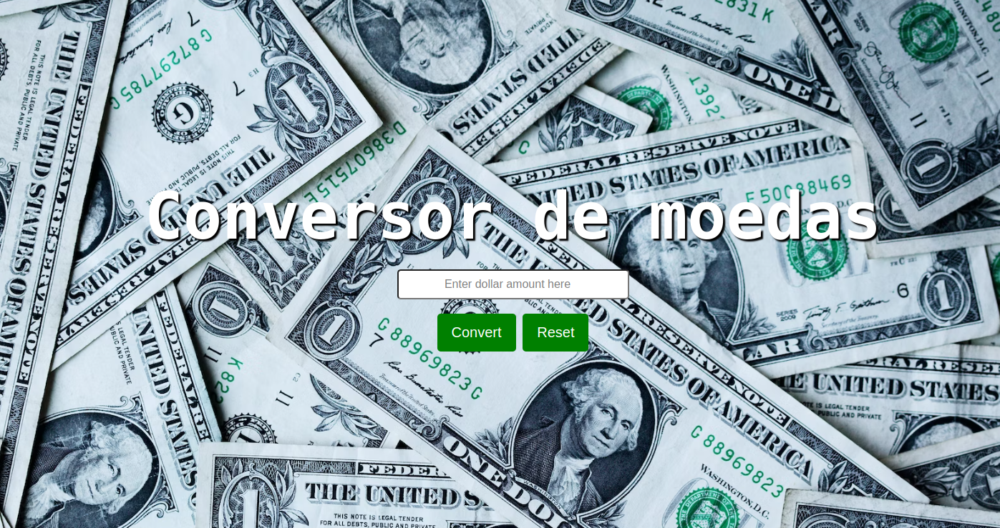

<h1 align="center"> Converter 💵💰 </h1>

# Sobre o projeto 💲
Esse projeto foi feito para fins didáticos na Imersão Dev do Alura, melhorei o projeto adicionando algumas funcionalidades, a própria pessoa que acessa o site pode escolher o valor a ser convertido, também criei os botões, um inicia a conversão e o outro limpa os campos para uma nova conversão ser feita, a estilização também foi criada por mim.
 

# Como acessar o projeto? 🤔

Basta clicar [AQUI](https://analudms.github.io/Converter/) que você será direcionado!

# Apresentação 👀

  

# Tecnologias 💻
- HTML e CSS.
- Javascript.
- Git e Github.

# Autor 👩🏻

Ana Luiza de Melo Soares.  
https://www.linkedin.com/in/ana-luiza-melo-8b94181b3/